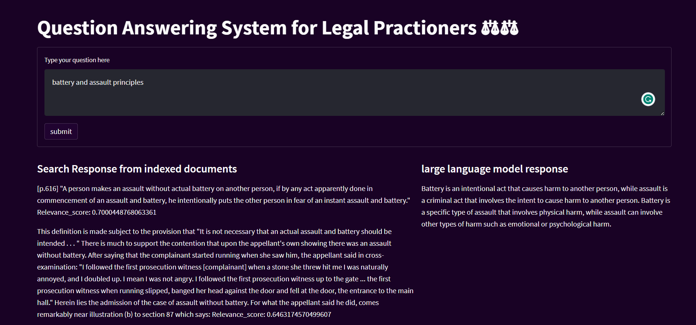

# *Project Title: Question-Answering System with SentenceTransformers(multi-qa-distilbert-cos-v1), ElasticSearch, Docker, Flask, and Generative AI* 👩‍⚖️
-----------

# Project video on Youtube
| Title | link |
|-------|------|
| Question answering system | https://youtu.be/ntefKa9HedU    |
## Project Summary 📖
==================

This project aims to develop a simple Question-Answering (QA) system that leverages cutting-edge technologies and machine learning techniques. The system's core functionalities include searching for relevant passages in a given corpus and providing direct, concise, and accurate answers to user queries. The key components of this project are:

1. **SentenceTransformers for Embeddings:** We utilize SentenceTransformers(multi-qa-distilbert-cos-v1), a state-of-the-art model, to generate high-quality embeddings for text passages. These embeddings capture the semantic meaning of the text and are crucial for accurate QA.

2. **ElasticSearch as a Vector Store:** ElasticSearch is employed as the vector store to efficiently index and retrieve the embeddings. This ensures fast and accurate searching of relevant passages.

3. **Docker for Containerization and Deployment:** Docker containers are used to package the QA system, making it portable and easily deployable across various environments. This enhances system scalability and reproducibility.

4. **Flask for the API:** A Flask-based API is developed to handle user queries. Users can submit questions, and the system retrieves relevant passages and answers. Flask provides a lightweight and efficient framework for building APIs.

5. **Generative AI for Direct Answers:** In addition to retrieving relevant passages, we integrate Generative AI models-[Falcon 7b found here](https://huggingface.co/tiiuae/falcon-7b-instruct) to provide direct, concise, and accurate answers to user questions. 

6. **Streamlit for User Interface:** To interact with the ML system, we create a user-friendly web-based interface using Streamlit. This UI allows users to input their questions, view relevant passages, and receive direct answers, making the system accessible and intuitive.

#  Getting Started 🚀
==============
1. **Clone the Repository:** Clone this repository to your local machine.

2. **🔧Install Dependencies:** 

 follow these installation steps:
bash
# setup the environment on windows by running the following code.
```python -m venv venv; venv\Scripts\activate; python -m pip install -q --upgrade pip; python -m pip install -r requirements.txt```  

#On Linux
```python3 -m venv venv; source venv/bin/activate; python -m pip install -q --upgrade pip; python -m pip install -r requirements.txt``` 


The Two commands are of the same structure

    i.Activate the python environment

    ii.Upgrade pip to it current version

    iii.install the requirements located in requirements.txt: You should be at the root of your env

3. ** Elasticsearch configuration:** Create a free elasticsearch cloud  subscription [here](https://www.elastic.co/). you can also download elasticsearch and kibana to be run locally [Elasticsearch download](https://www.elastic.co/downloads/elasticsearch) This step is not necessary if you just want to try the app

4. **Run Flask app (API)** : ```python run: python app\app.py``` This will start the flask app in development mode 

5. **Test Api endpoints**: Download postman or your preffered api testing to send request to the ```localhost:5000/ask``` endpoint

6. **Start streamlit**: You can skip step 5 to interact with the system in a Graphical  user interface
while keeping the flask app running:

- Open another command prompt

- navigate to the location of the question answering system using cd

- activate the environment

run ``` python
streamlit run app\gui.py ```

 The streamlit interface will look like this
 
  
 
with place to type a question and response from indexed documents and falcon 7b

 **Author** 👥
=================

This project is developed and maintained by:
- Sylvester Junior Ampomah 💡
Feel free to reach out to us with any questions or feedback!

 **Acknowledgments** ✨
=================
This project was done as part of Kwame AI Junior machine learning engineer coding challenge

 **Contact** 📞
=================

For any questions, concerns, or suggestions regarding  this project, please contact me at sylvesterjnr87@gmail.com.
